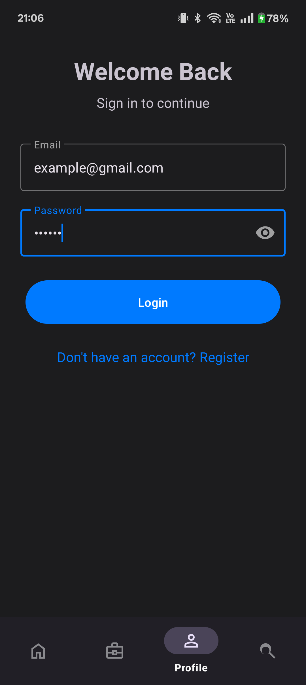
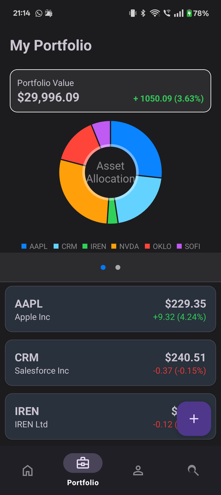
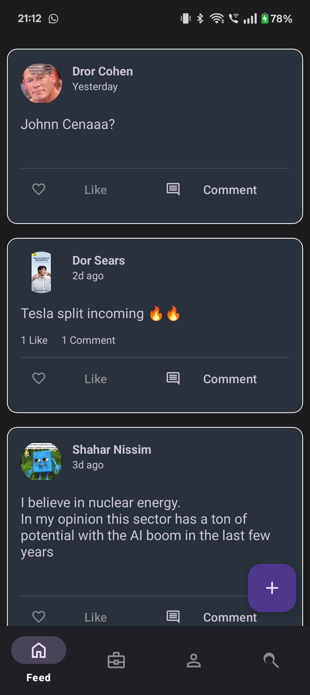
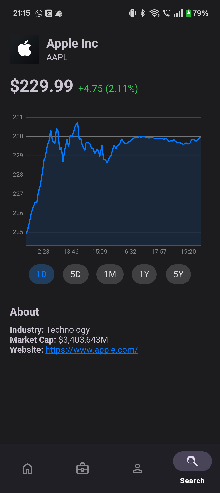
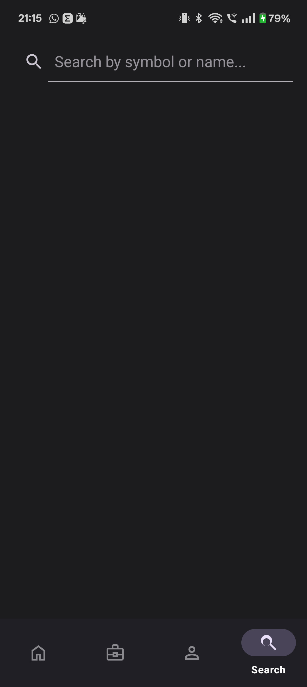
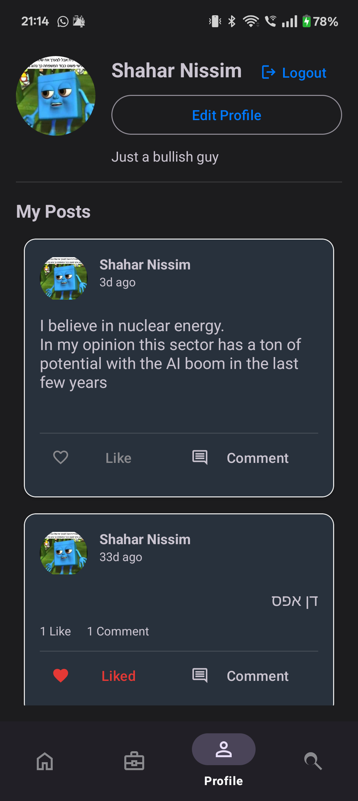
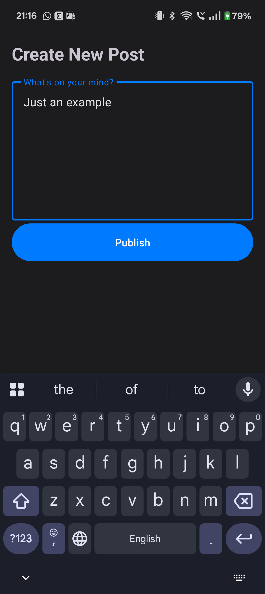
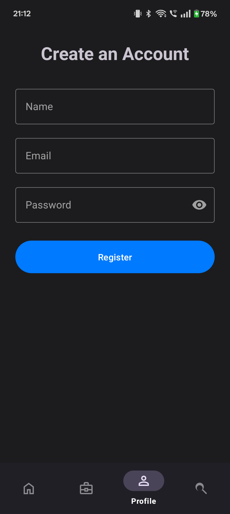

# 📈 Stoxie - Social Stock Portfolio Tracker

<div align="center">
  
  
  
  
  
  
  
  **A modern Android app that combines social networking with stock portfolio management**
  
  [📱 Demo Video](#-demo-video) • [🚀 Features](#-features) • [🛠️ Setup](#-setup--installation) • [🏗️ Architecture](#-architecture)
</div>

---

## 📱 Demo Video

> **📺 [Watch the full app demonstration on YouTube](https://youtube.com/shorts/mEkX5mZoS8s?feature=share)**

<div align="center">
  <a href="https://youtube.com/shorts/b9AgZZFTpn4?feature=share">
    
  </a>
  <br>
  <em>🎬 Click the thumbnail above to watch the full demo on YouTube</em>
</div>

---

## ✨ Features

### 🏦 **Portfolio Management**

- **Real-time Stock Tracking** - Live price updates using Finnhub API
- **Portfolio Analytics** - Interactive pie charts for allocation and sector analysis
- **Performance Metrics** - Track gains/losses with visual indicators
- **Cost Averaging** - Automatic calculation when adding positions
- **Swipe to Delete** - Intuitive portfolio management with undo functionality

### 👥 **Social Feed**

- **Share Insights** - Post your market thoughts and analysis
- **Community Engagement** - Like and comment on posts
- **Real-time Updates** - Live feed with instant notifications
- **User Profiles** - Customizable profiles with bio and profile pictures

### 📊 **Stock Analysis**

- **Advanced Search** - Find stocks by symbol or company name
- **Interactive Charts** - Multiple timeframes (1D, 5D, 1M, 3M, 1Y, 5Y)
- **Company Profiles** - Detailed company information and metrics
- **Historical Data** - Comprehensive price history with Alpha Vantage integration

### 🔐 **Security & Authentication**

- **Firebase Authentication** - Secure user management
- **Data Privacy** - Personal portfolios remain private
- **Cloud Storage** - Profile pictures stored securely
- **Real-time Sync** - Data synchronized across devices

---

## 📸 Screenshots

<div align="center">
  <table>
    <tr>
      <td align="center">
        
        <br><b>Authentication</b>
      </td>
      <td align="center">
        
        <br><b>Portfolio Dashboard</b>
      </td>
      <td align="center">
        
        <br><b>Social Feed</b>
      </td>
      <td align="center">
        
        <br><b>Stock Analysis</b>
      </td>
    </tr>
  </table>
</div>

<details>
<summary><b>📱 View More Screenshots</b></summary>

<div align="center">
  <table>
    <tr>
      <td align="center">
        
        <br><b>Stock Search</b>
      </td>
      <td align="center">
        
        <br><b>User Profile</b>
      </td>
      <td align="center">
        
        <br><b>Create Post</b>
      </td>
      <td align="center">
        
        <br><b>Registration</b>
      </td>
    </tr>
  </table>
</div>

</details>

---

## 🛠️ Tech Stack

### **Frontend**

- **Kotlin** - Modern Android development
- **Material Design 3** - Google's latest design system
- **View Binding** - Type-safe view references
- **Navigation Component** - Single Activity architecture

### **Architecture**

- **MVVM Pattern** - Model-View-ViewModel architecture
- **Repository Pattern** - Clean data layer abstraction
- **LiveData & StateFlow** - Reactive UI updates
- **Coroutines** - Asynchronous programming

### **Backend & APIs**

- **Firebase** - Authentication, Firestore, Cloud Storage
- **Finnhub API** - Real-time stock data and company profiles
- **Alpha Vantage API** - Historical stock data for charts
- **Retrofit** - HTTP client for API communication

### **UI Components**

- **RecyclerView** - Efficient list management with DiffUtil
- **MPAndroidChart** - Interactive stock charts
- **Coil** - Image loading and caching
- **SwipeRefreshLayout** - Pull-to-refresh functionality

---

## 🚀 Setup & Installation

### **Prerequisites**

- Android Studio Hedgehog or newer
- JDK 8 or higher
- Android SDK (minSdk 26, targetSdk 35)
- Firebase project setup
- API keys for Finnhub and Alpha Vantage

### **1. Clone the Repository**

```bash
git clone https://github.com/shaharnissim/stoxie.git
cd stoxie
```

### **2. Firebase Setup**

1. Create a new project in the [Firebase Console](https://console.firebase.google.com/)
2. Add an Android app with package name: `com.shahar.stoxie`
3. Download `google-services.json` and place it in the `app/` directory
4. Enable the following Firebase services:
   - **Authentication** (Email/Password)
   - **Firestore Database**
   - **Cloud Storage**

### **3. API Keys Configuration**

Create a `local.properties` file in the project root and add your API keys:

```properties
# Finnhub API Key (for real-time data and search)
FINNHUB_API_KEY=your_finnhub_api_key_here

# Alpha Vantage API Key (for historical charts)
ALPHA_VANTAGE_API_KEY=your_alpha_vantage_api_key_here
```

**Get Your API Keys:**

- **Finnhub**: [Sign up at finnhub.io](https://finnhub.io/) (Free tier: 60 calls/minute)
- **Alpha Vantage**: [Get API key at alphavantage.co](https://www.alphavantage.co/support/#api-key) (Free tier: 5 calls/minute)

### **4. Build & Run**

```bash
# Using Android Studio
1. Open the project in Android Studio
2. Sync project with Gradle files
3. Run the app on device/emulator

# Using Command Line
./gradlew assembleDebug
./gradlew installDebug
```

---

## 🏗️ Architecture

<div align="center">
  
</div>

### **Single Activity Architecture**

- **MainActivity** - Hosts all fragments using Navigation Component
- **Fragment-based UI** - Modular screens with shared ViewModels
- **Bottom Navigation** - Seamless navigation between main features

### **Data Layer**

```
📁 data/
├── 🔐 AuthRepository      # User authentication
├── 📊 PortfolioRepository # Portfolio management
├── 📱 PostRepository      # Social feed
├── 📈 StockRepository     # Market data
├── 👤 UserRepository      # User profiles
└── 💾 StorageRepository   # File uploads
```

### **UI Layer**

```
📁 ui/
├── 🔑 auth/              # Login & Registration
├── 📱 main/              # Core app features
└── 🎨 adapters/          # RecyclerView adapters
```

### **Network Layer**

```
📁 network/
├── 📊 FinnhubClient      # Real-time stock data
├── 📈 AlphaVantageClient # Historical data
└── 📋 Data Models        # API response models
```

---

## 🎯 Key Features Deep Dive

### **Portfolio Management**

- **Real-time Updates**: Stock prices update automatically using Finnhub API
- **Cost Basis Tracking**: Automatically calculates average cost when adding shares
- **Performance Analytics**: Visual representation of gains/losses with color coding
- **Sector Analysis**: Pie charts showing portfolio allocation by industry

### **Social Features**

- **Real-time Feed**: Posts appear instantly using Firestore real-time listeners
- **Engagement**: Like and comment system with real-time updates
- **User Profiles**: Customizable profiles with Firebase Storage integration

### **Technical Highlights**

- **Offline Support**: Cached data with seamless online/offline transitions
- **Error Handling**: Comprehensive error handling with user-friendly messages
- **Performance**: Efficient list updates using DiffUtil and optimized RecyclerView
- **Security**: Firestore security rules ensure data privacy

---

## 📋 API Documentation

### **Finnhub Integration**

```kotlin
// Real-time stock quotes
GET /quote?symbol=AAPL&token=API_KEY

// Company profiles
GET /stock/profile2?symbol=AAPL&token=API_KEY

// Symbol search
GET /search?q=Apple&token=API_KEY
```

### **Alpha Vantage Integration**

```kotlin
// Historical data
GET /query?function=TIME_SERIES_DAILY&symbol=AAPL&apikey=API_KEY

// Intraday data
GET /query?function=TIME_SERIES_INTRADAY&interval=5min&symbol=AAPL&apikey=API_KEY
```

---

## 🚀 Future Enhancements

- [ ] **Push Notifications** - Stock alerts and social notifications
- [ ] **Dark Mode** - Complete dark theme implementation
- [ ] **Watchlist** - Track stocks without purchasing
- [ ] **Paper Trading** - Simulate trades without real money
- [ ] **News Integration** - Financial news feed
- [ ] **Advanced Charts** - Technical indicators and analysis tools
- [ ] **Export Features** - Portfolio reports and tax documents
- [ ] **Social Following** - Follow other users and their portfolios

---

## 🤝 Contributing

We welcome contributions! Please see our [Contributing Guidelines](CONTRIBUTING.md) for details.

1. **Fork the repository**
2. **Create a feature branch**: `git checkout -b feature/amazing-feature`
3. **Commit your changes**: `git commit -m 'Add amazing feature'`
4. **Push to the branch**: `git push origin feature/amazing-feature`
5. **Open a Pull Request**

---

## 📄 License

This project is licensed under the MIT License - see the [LICENSE](LICENSE) file for details.

---

## 🙏 Acknowledgments

- **[Firebase](https://firebase.google.com/)** - Backend infrastructure
- **[Finnhub](https://finnhub.io/)** - Real-time market data
- **[Alpha Vantage](https://www.alphavantage.co/)** - Historical stock data
- **[MPAndroidChart](https://github.com/PhilJay/MPAndroidChart)** - Chart visualization
- **[Material Design](https://material.io/)** - UI/UX guidelines

---

## 📞 Contact

**Mail**: [Send Email](mailto:nissim2911@gmail.com)
**LinkedIn**: [Shahar Nissim](https://www.linkedin.com/in/nissim-shahar/)

---

<div align="center">
  <p><strong>⭐ Star this repository if you found it helpful!</strong></p>
  
  
  
  
</div>
